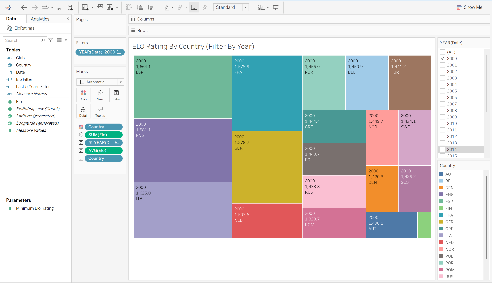

# ELO Ratings Tableau Dashboard

This project visualizes and analyzes ELO ratings for European football clubs and countries over the last decade using Tableau.

## Files
- `dataViz_sheets.twb`: Tableau workbook with all dashboards and sheets
- `EloRatings.csv`: Raw data used for analysis
- `/images/`: Screenshots of dashboards

## Dashboards
- **ELO Ratings for Clubs/Countries**: Interactive bubble chart by country
- **Club Rating (Last 5 Years)**: Compare top clubs’ ELO ratings
- **Country Rating (Last 5 Years)**: Trends by country
- **ELO Rating By Country (2024 Only)**: Treemap of country averages

## How to View
- Open `dataViz_sheets.twb` in Tableau Public/Desktop.
- Or, view the interactive version on [Tableau Public](https://public.tableau.com/app/profile/robert.gorman4725/viz/dataViz_sheets/ELORatingByCountryFilterByYear?publish=yes).

## Sample Visuals

